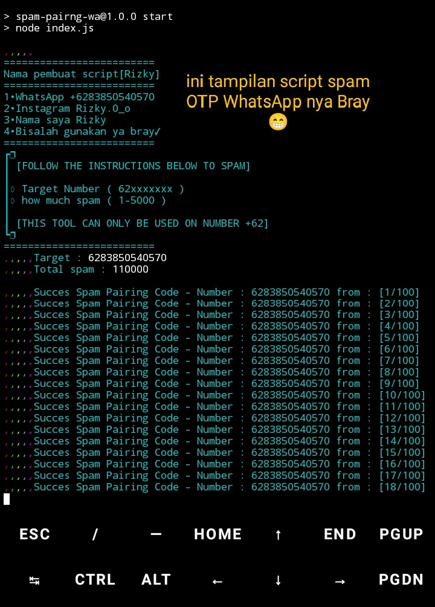

# spam-pairing-wa
Tools Spam Pairing Whatsapp using Javascript and Nodejs
<div align="center">
  <p>
    
  </p>
## Install in Windows with Gitbash
You need to Install Nodejs and Git on your Device
```bash
git clone https://github.com/Rizky598/OTP.Wa.git
```

## Run spam-pairng-wa
```bash
cd OTP.Wa
npm install
npm start
```

## Support Me
<ul>
  <li><strong>Tiktok</strong>: <a href="https://www.tiktok.com/@flow.falcon">@flow.falcon</a></li>
  <li><strong>Website</strong>: <a href="https://www.flowfalcon.xyz/">https://www.flowfalcon.xyz/</a></li>
  <li><strong>Github</strong>: <a href="https://github.com/FlowFalcon">https://github.com/FlowFalcon</a></li>
</ul>

### Whatsapp Group

[](https://chat.whatsapp.com/CktCFlTbTiMLq5K4fgIidd)

$$ Allen BotWhatsappMD $$
